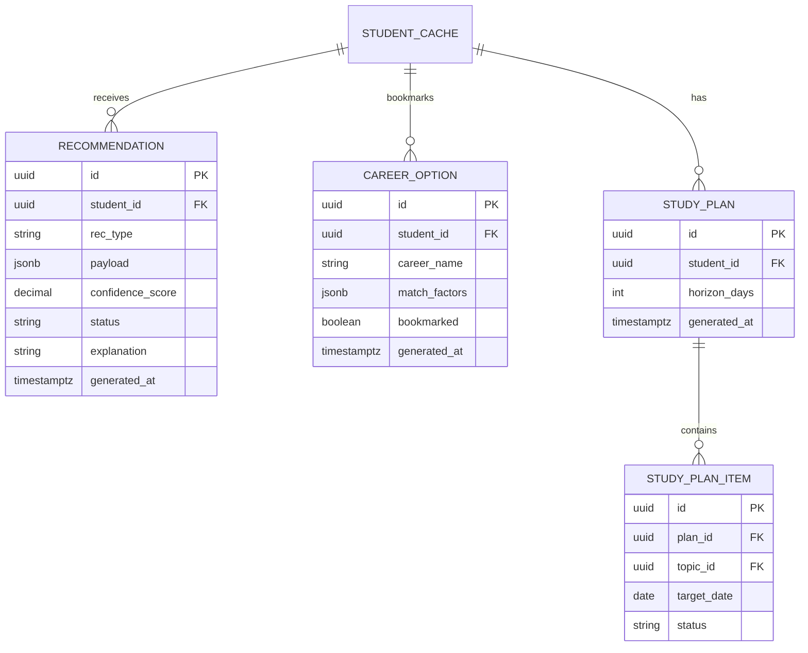
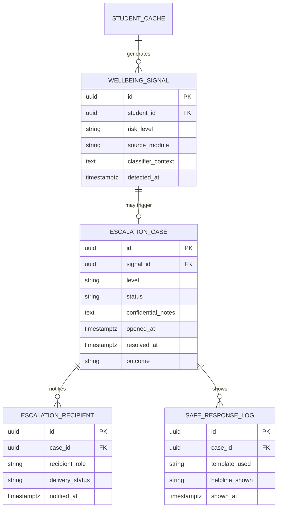
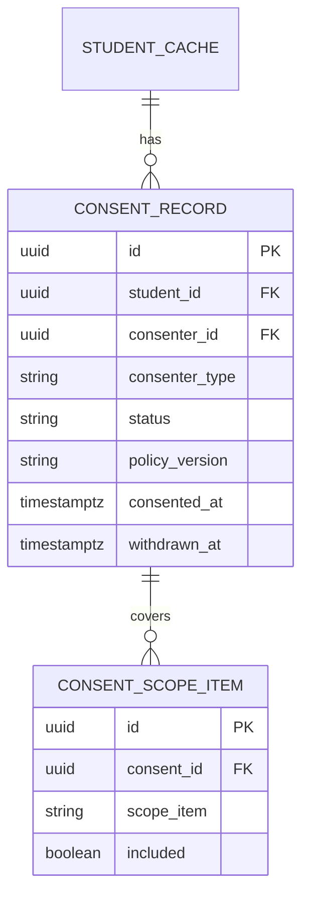
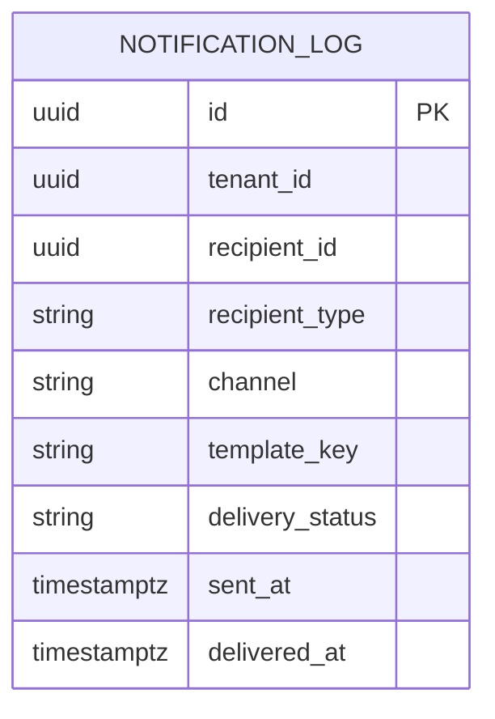

# MASTER SRS — P3 AI STUDENT COACH
## Part 9 — Technical Specifications
### 9.3 Database Design — Batch C: Recommendations, Wellbeing & Safety, Consent Records, Notification (closes 9.3)

*Layer 4 — Technical & Architecture*

| Field | Value |
|---|---|
| Product | P3 — AI Student Coach |
| Identifier range (this document) | AIC-TR-161 → AIC-TR-172 |
| Domains covered | Recommendations & Career Output, Wellbeing & Safety (isolated schema), Consent Records, Notification & Delivery |
| Shared convention | `id`, `tenant_id`, `created_at`, `updated_at` apply per 9.3.0 (Batch A) and are not repeated. |

---

## 9.3.10  Recommendations & Career Output Domain (P3-owned) — 🟠 `#C9762E`

**Figure 9i — Recommendations & Career Output ER diagram.**

| Table | Field | Type | Constraint | Description |
|---|---|---|---|---|
| `recommendation` | `rec_type` | enum | NOT NULL — {next_topic, revision_item, resource, study_plan_ref} | (AIC-FR-142/143/144) |
| `recommendation` | `payload` | jsonb | NOT NULL | Variant content per `rec_type` |
| `recommendation` | `confidence_score` | decimal | NOT NULL, 0.00–1.00 | Consumed by the Confidence Gate (8.4.2); rows below the configured threshold are not surfaced (BR-AIC-N-03) but are still stored for audit/tuning |
| `recommendation` | `status` | enum | NOT NULL — {surfaced, accepted, dismissed, cooldown}, default `surfaced` | AIC-FR-148 |
| `recommendation` | `explanation` | string | NOT NULL | The "why this" text (AIC-FR-147) |
| `career_option` | `match_factors` | jsonb | NOT NULL | Profile factors behind the match (AIC-FR-076) |
| `career_option` | `bookmarked` | boolean | NOT NULL, default `false` | (SCR-CAR-005) |
| `study_plan_item` | `topic_id` | UUID | FK → `curriculum_topic_cache.topic_id`, NOT NULL | Plan items are always in-stage topics (BR-AIC-N-01) |
| `study_plan_item` | `status` | enum | NOT NULL — {pending, done, skipped} | — |

**Indexes:** `recommendation(student_id, status, generated_at DESC)`. `recommendation(student_id, rec_type)` partial index `WHERE status = 'surfaced'` — supports the volume-cap check (BR-AIC-N-04) at write time.
**Constraints:** A `recommendation` insert is rejected at the application layer (not DB constraint, since the cap is a configurable runtime value per AIC-TR-037-style pattern) if it would exceed the per-cycle volume cap for that student.

**AIC-TR-161:** Every `recommendation` and `career_option` row's `payload`/`match_factors` content shall be traceable to the Knowledge Graph and/or Learning Profile signal that produced it, satisfying AIC-TR-070's traceability requirement at the schema level (no recommendation is stored without its generating signal reference embedded in the payload).
**AIC-TR-162:** `study_plan_item.topic_id` shall be validated against the student's current `grade_stage` (via `student_cache`) at insert time; a plan item referencing an out-of-stage topic shall be rejected.
**AIC-TR-163:** Writes to this domain that mirror back to P1 (per BR-AIC-011) shall be idempotent — a retried write after a transient P1 failure shall not create duplicate P1-side records.

---

## 9.3.11  Wellbeing & Safety Domain (P3-owned, isolated schema) — 🔴 `#8E1F2F`

This domain lives in its **own PostgreSQL schema** (`wellbeing`), with row-level security restricting confidential-field access to the Wellbeing Coach Service and Psychologist-scoped queries only (AIC-TR-054), distinct from the `public`/default schema used by other domains.

**Figure 9j — Wellbeing & Safety ER diagram.**

| Table | Field | Type | Constraint | Description |
|---|---|---|---|---|
| `wellbeing_signal` | `risk_level` | enum | NOT NULL — {l1, l2, l3} | Output of the Signal Classifier (8.4.2) |
| `wellbeing_signal` | `source_module` | enum | NOT NULL — {wellbeing_checkin, tutor, homework, career} | Per BR-AIC-W-06, risk detection applies cross-module |
| `wellbeing_signal` | `classifier_context` | text | NOT NULL, **field-level encrypted** (AIC-TR-094) | The interaction snippet that triggered classification — confidential |
| `escalation_case` | `level` | enum | NOT NULL — {l1, l2, l3} | — |
| `escalation_case` | `status` | enum | NOT NULL — {open, acknowledged, resolved}, default `open` | — |
| `escalation_case` | `confidential_notes` | text | NULLABLE, **field-level encrypted** | Psychologist-only detail (BR-AIC-W-07) |
| `escalation_case` | `outcome` | enum | NULLABLE — {true_positive, false_positive, resolved, referred} | AIC-FR-100 |
| `escalation_recipient` | `recipient_role` | enum | NOT NULL — {psychologist, school_admin, safeguarding_lead, emergency_contact} | — |
| `escalation_recipient` | `delivery_status` | enum | NOT NULL — {sent, delivered, failed, backup_used} | Supports BR-AIC-W-05's backup-recipient failover |
| `safe_response_log` | `template_used` | string | NOT NULL | References the clinician/DPO-approved template (AIC-TR-066) — never free-text |
| `safe_response_log` | `helpline_shown` | string | NULLABLE | NULL if no helpline was configured for the region (BR-AIC-W-10) — the absence is itself meaningful and logged, not silently defaulted |

**Row-level security:** `wellbeing_signal.classifier_context` and `escalation_case.confidential_notes` are readable only by the `wellbeing_service_role` and `psychologist_role`; the Teacher/Parent summary views (SCR-TWELL-001/SCR-PWELL-001) query a separate `escalation_case_summary` view exposing only `level`, `status`, and a pre-approved non-confidential summary string — never these two columns directly (BR-AIC-O-02/BR-AIC-W-07).

**AIC-TR-164:** The `wellbeing` schema shall be created with row-level security enabled by default on every table at creation time, not added retroactively, given the severity of a misconfiguration in this domain.
**AIC-TR-165:** `escalation_case` rows shall never be hard-deleted; resolution is represented by `status = 'resolved'`, preserving the full case for the retention period pending Gap G14.
**AIC-TR-166:** `escalation_recipient.delivery_status = 'failed'` shall trigger the backup-recipient insert (a new `escalation_recipient` row for the backup) within the same transaction or an immediately-following compensating transaction, never left as a dangling failed state (BR-AIC-W-05).
**AIC-TR-167:** `safe_response_log.template_used` shall be a foreign key into a clinician/DPO-approved template table (not modeled in this batch, finalized alongside ASM-AIC-03 sign-off) — free-text safe-response content is structurally prevented, not just discouraged by convention.

---

## 9.3.12  Consent Records Domain (P3-owned) — 🟣 `#7A4FA0`

**Figure 9k — Consent Records ER diagram.**

| Table | Field | Type | Constraint | Description |
|---|---|---|---|---|
| `consent_record` | `consenter_id` | UUID | FK → `guardian_link_cache.guardian_id` OR `student_cache.student_id` (self-consent, 18+) | Polymorphic by `consenter_type` |
| `consent_record` | `consenter_type` | enum | NOT NULL — {guardian, self} | — |
| `consent_record` | `status` | enum | NOT NULL — {pending, approved, withdrawn}, default `pending` | — |
| `consent_record` | `policy_version` | string | NOT NULL | Semantic version of the notice/policy consented to (AIC-FR-178); a policy version bump invalidates prior consent (BR-AIC-S-08) |
| `consent_record` | `consented_at` / `withdrawn_at` | timestamptz | NULLABLE | — |
| `consent_scope_item` | `scope_item` | enum | NOT NULL — {tutoring, revision, career, wellbeing, data_processing} | (4.10.8) |
| `consent_scope_item` | `included` | boolean | NOT NULL | — |

**Indexes:** `consent_record(student_id, status)` — the activation-gate lookup (AIC-FR-176) hits this index on every session start.
**Constraints:** **No anonymization at 24 months** for `consent_record` while the student's `student_cache.enrollment_status = 'active'` (AIC-TR-063) — this table is explicitly excluded from the standard retention job's scope by a `WHERE` condition referencing the live enrollment status, not by omission.

**AIC-TR-168:** A `consent_record` insert with `policy_version` older than the current published policy version shall be rejected; only consent to the current policy version is valid (BR-AIC-S-08).
**AIC-TR-169:** Activation-gate queries (AIC-FR-176) shall check both `consent_record.status = 'approved'` and that the relevant `consent_scope_item.included = true` for the specific module being entered — coarse "any consent" is not sufficient if a guardian approved only a subset of scope items.
**AIC-TR-170:** `consent_record.withdrawn_at` being set shall trigger the access-suspension process (BR-AIC-S-02) as a downstream effect, not as an inline database trigger that could obscure the suspension logic from the Consent & Safety Service's own audit trail — the application service performs and logs the suspension explicitly.

---

## 9.3.13  Notification & Delivery Domain (P3-owned, transient) — ⚪ `#808080`

**Figure 9l — Notification & Delivery ER diagram.**

| Field | Type | Constraint | Description |
|---|---|---|---|
| `recipient_id` | UUID | NOT NULL | Student, guardian, teacher, or admin identifier depending on `recipient_type` |
| `recipient_type` | enum | NOT NULL — {student, guardian, teacher, admin} | — |
| `channel` | enum | NOT NULL — {sms, email, push} | — |
| `template_key` | string | NOT NULL | References the notification template (SCR-STEMPL-001) |
| `delivery_status` | enum | NOT NULL — {queued, sent, delivered, bounced, failed} | Updated by provider webhook (AIC-TR-046) |
| `sent_at` / `delivered_at` | timestamptz | `delivered_at` NULLABLE | — |

**Retention:** Per 8.6.1, this table retains delivery-status summary only, briefly, for audit — not the full message payload long-term. The full payload exists transiently in the Redis-backed job queue (BullMQ, 9.2.2) during dispatch and is not duplicated into this table.

**AIC-TR-171:** `notification_log` shall store the `template_key` used and delivery metadata, not the rendered message body, since the body is reconstructable from the template and is not needed for audit purposes — this keeps the table free of potentially sensitive rendered content (e.g., a wellbeing-related notification's specific wording) beyond what audit genuinely requires.
**AIC-TR-172:** Webhook-driven `delivery_status` updates (AIC-TR-046) shall be idempotent against repeated webhook delivery from the provider (a common provider behavior), using the provider's own delivery-event ID to deduplicate.

---

### Layer 4 gate status — Part 9.3 Batch C (and 9.3 overall)

| Gate item | Minimum Standard | Status |
|---|---|---|
| ERD coverage | Every entity in this batch is in an ERD | Pass — Figures 9i–9l |
| Data dictionary | Every field documented | Pass |
| Table specs, indexes, constraints | Required | Pass |
| **9.3 overall** | Every entity across all 12 domains in an ERD; every field documented | **Pass — 12 domains, Figures 9a–9l (12 ER diagrams), full data dictionary** |

*Part 9.3 complete. Next: 9.4 — API Specifications (full endpoint catalog, request/response schemas, sequence diagrams for complex flows, rate limiting, error code matrix).*
