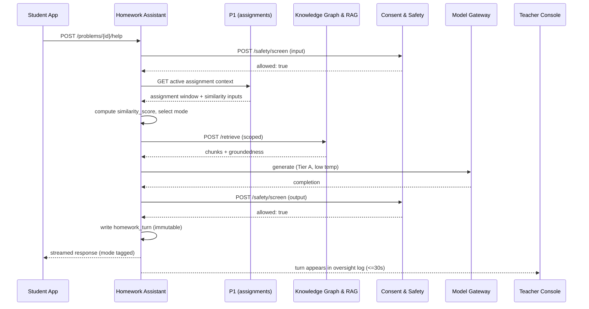
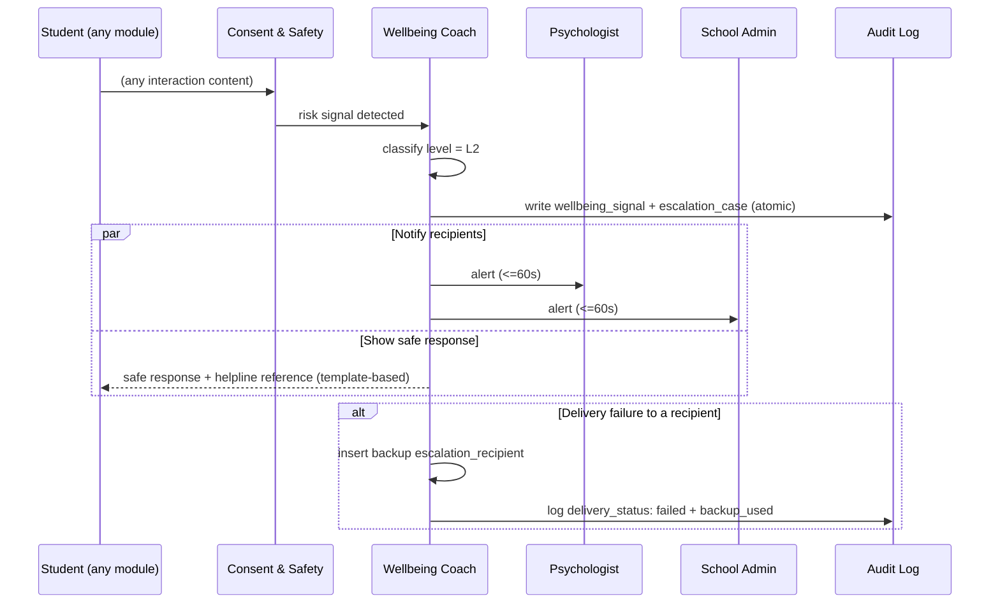
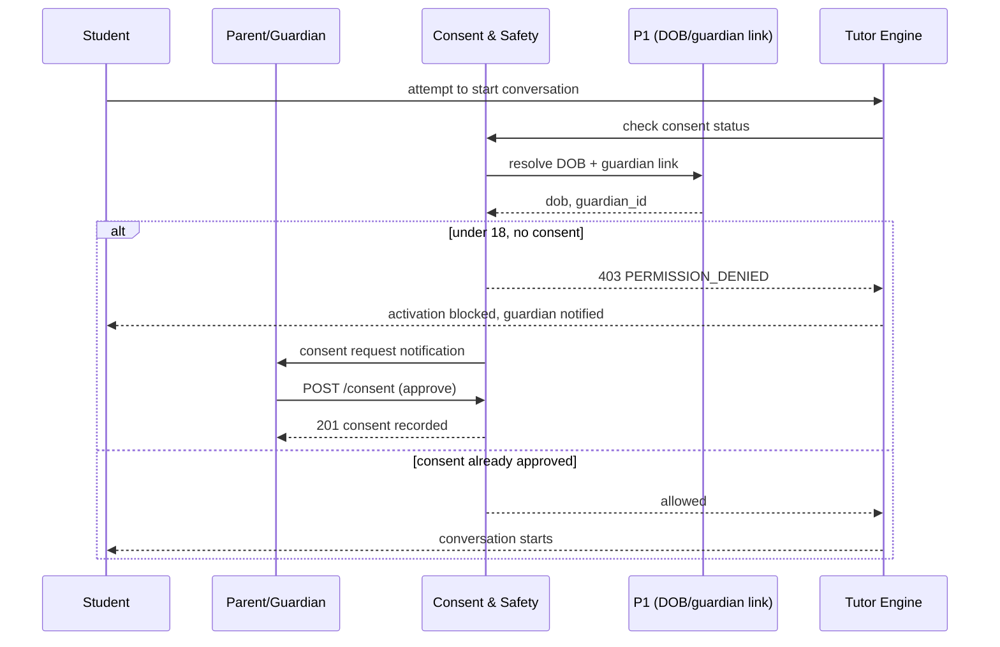

# MASTER SRS — P3 AI STUDENT COACH
## Part 9 — Technical Specifications
### 9.4 API Specifications — Batch C: Teacher Oversight, Consent & Safety, Admin & Configuration, Notification (closes 9.4)

*Layer 4 — Technical & Architecture*

| Field | Value |
|---|---|
| Product | P3 — AI Student Coach |
| Identifier range (this document) | AIC-TR-197 → AIC-TR-210 |
| Conventions | Per Part 9.4 Batch A, Section 9.4.1 |

---

## 9.4.12  Teacher Oversight Service — `/api/v1/oversight`

| Method | Path | Auth (role) | Request | Response | Key Errors |
|---|---|---|---|---|---|
| GET | `/dashboard` | Teacher (assigned classes) | Query: `class_id` | `200` `{ usage_summary, flag_count, wellbeing_count }` | `403 PERMISSION_DENIED` |
| GET | `/flags` | Teacher (assigned) | Query: `type?, from?, to?, cursor?` | `200` `{ flags[] }` | `403 PERMISSION_DENIED` |
| GET | `/flags/{id}/transcript` | Teacher (assigned) | — | `200` `{ turns[] }` | `404 NOT_FOUND` |
| POST | `/flags/{id}/acknowledge` | Teacher (assigned) | `{ note }` | `200` `{}` | `422 NOTE_REQUIRED` |

**AIC-TR-197:** `GET /flags` and `GET /dashboard` shall derive the class scope server-side from the authenticated teacher's assignment record (P1-mirrored), never trusting a `class_id` query parameter alone as the access boundary — the parameter filters within the already-scoped set, it does not expand it (restates AIC-TR-177's pattern for this service).

---

## 9.4.13  Consent & Safety Service — `/api/v1/consent` and `/api/v1/safety`

| Method | Path | Auth (role) | Request | Response | Key Errors |
|---|---|---|---|---|---|
| GET | `/consent/status` | Student / Parent (own/child) | — | `200` `{ status, scope_items[] }` | — |
| POST | `/consent` | Parent (child) / Student (self, 18+) | `{ scope_items[], policy_version }` | `201` `{ consent_id }` | `422 POLICY_VERSION_STALE` |
| POST | `/consent/{id}/withdraw` | Parent (child) | `{}` | `200` `{}` | `404 NOT_FOUND` |
| GET | `/consent/register` | School Admin (own tenant) | Query: `status?, grade?` | `200` `{ records[] }` | `403 PERMISSION_DENIED` |
| POST | `/safety/screen` **[internal, service-to-service only]** | Other P3 services (scoped JWT) | `{ content, direction: "input"\|"output" }` | `200` `{ allowed: boolean, category? }` | `503 CLASSIFIER_UNAVAILABLE` → caller must fail closed |

**AIC-TR-198:** `POST /safety/screen` returning `503 CLASSIFIER_UNAVAILABLE` shall be treated by every calling service as an implicit `allowed: false` — there is no code path in any caller that proceeds with unscreened content on a `503` (restates BR-AIC-S-04 at the API contract level; this is the single most safety-critical error-handling rule in the entire catalog).
**AIC-TR-199:** `POST /consent` shall validate `policy_version` against the currently published version server-side and reject (`422 POLICY_VERSION_STALE`) any attempt to consent to an outdated version, even if a client is running stale cached policy text (BR-AIC-S-08).

---

## 9.4.14  Admin & Configuration Service — `/api/v1/admin`

| Method | Path | Auth (role) | Request | Response | Key Errors |
|---|---|---|---|---|---|
| POST | `/tenants` | Super Admin | `{ school_name, region, languages[] }` | `201` `{ tenant_id }` | `422 REGION_NOT_SUPPORTED` |
| PATCH | `/tenants/{id}/sections/{section_id}/enable` | School Admin (own) | `{ enabled: boolean }` | `200` `{}` | `403 PERMISSION_DENIED` |
| PATCH | `/gateway/routing` | Super Admin | `{ tier, providers[] }` | `200` `{}` | `422 VALIDATION_ERROR` |
| PATCH | `/gateway/token-cap` | Super Admin | `{ cap_tokens, throttle_policy }` | `200` `{}` | `422 BELOW_FLOOR` |
| PATCH | `/thresholds` | Super Admin | `{ key, value }` | `200` `{}` (or `202 pending` if safety-critical) | `422 OUT_OF_RANGE` |
| PUT | `/helplines/{tenant_id}/{region}` | School Admin / DPO | `{ channel, contact_value }` | `202` `{ approval_status: "pending" }` | `422 VALIDATION_ERROR` |
| GET | `/reports/usage` | School Admin (own) / Super Admin (cross-tenant) | Query: `period` | `200` `{ usage[] }` | — |
| GET | `/audit` | Super Admin / Auditor | Query: `tenant_id?, type?, from?, to?` | `200` `{ entries[] }` | `403 PERMISSION_DENIED` |
| PATCH | `/feature-flags/{key}` | Super Admin | `{ tenant_id, enabled }` | `200` `{}` | `404 NOT_FOUND` |

**AIC-TR-200:** `PUT /helplines/{tenant_id}/{region}` shall always return `202 pending`, never `200`, since helpline changes are safety-critical and require approval (AIC-TR-091/BR-AIC-A-04) — there is no direct-write path for this endpoint under any role, including Super Admin.

---

## 9.4.15  Notification Service — `/api/v1/notifications` (and provider webhooks)

| Method | Path | Auth | Request | Response | Key Errors |
|---|---|---|---|---|---|
| POST | `/dispatch` **[internal, service-to-service only]** | Other P3 services (scoped JWT) | `{ recipient_id, recipient_type, channel, template_key, params }` | `202` `{ notification_id }` | `422 VALIDATION_ERROR` |
| POST | `/webhooks/sms` | Provider (signed) | Provider-specific delivery payload | `200` `{}` | `401 INVALID_SIGNATURE` |
| POST | `/webhooks/email` | Provider (signed) | Provider-specific delivery payload | `200` `{}` | `401 INVALID_SIGNATURE` |
| POST | `/webhooks/push` | Provider (signed) | Provider-specific delivery payload | `200` `{}` | `401 INVALID_SIGNATURE` |

**AIC-TR-201:** All three webhook endpoints shall verify the provider's signature (AIC-TR-046) before processing the payload; a request with an invalid or missing signature returns `401 INVALID_SIGNATURE` and is not processed, logged only as a security event, never as a delivery-status update.

---

## 9.4.16  Sequence Diagrams — Complex Flows

### Flow 1 — Homework turn with integrity mode selection (Figure 10)

### Flow 2 — Wellbeing escalation, L2 (Figure 11)

### Flow 3 — Under-18 activation with consent gate (Figure 12)

**AIC-TR-202:** Figure 10's teacher-log visibility (≤30 seconds) and Figure 11's recipient-alert timing (≤60 seconds) are the binding SLA targets already established in Part 4 (AIC-FR-029/086); this section's sequence diagrams illustrate the call pattern that achieves them, and any future refactor of these flows shall preserve the same timing guarantee.
**AIC-TR-203:** Figure 11's parallel (`par`) notification and safe-response steps shall execute concurrently, not sequentially — the student must not wait for recipient-notification completion before seeing the safe response, since notification delivery latency (especially to an external SMS/email provider) is variable and outside P3's control.

---

## 9.4.17  Consolidated Rate Limiting (all services)

| Service | Endpoint group | Limit | Bypass? |
|---|---|---|---|
| Tutor Engine | Messages | 30/min per student | No |
| Homework Assistant | Help requests | 20/min per student | No |
| Revision Coach | Generation endpoints | 15/min per student | No |
| Career Coach | Recommendations/reports | 10/min per student | No |
| **Wellbeing Coach** | Check-ins, escalation path | **No limit** | **Yes — safety bypass (AIC-TR-007/098)** |
| Student Learning Profile | Reads/corrections | 30/min per student | No |
| Knowledge Graph & RAG | Internal retrieval | 100/min per calling service | No (service-to-service, not student-facing) |
| Personalization | Recommendation reads/feedback | 20/min per student | No |
| Teacher Oversight | Dashboard/flags/controls | 60/min per teacher | No |
| **Consent & Safety** | `/safety/screen` | **No limit** | **Yes — safety bypass, since every other service's request depends on it** |
| Admin & Configuration | All endpoints | 30/min per admin | No |
| Notification | Webhooks | Provider-side limits apply; P3 applies signature check, not a rate limit, to webhook ingress | N/A |

---

## 9.4.18  Consolidated Error Code Matrix (all batches)

| Code | HTTP Status | Originating Service(s) | Meaning |
|---|---|---|---|
| `TOKEN_CAP_REACHED` | 409 | Tutor, Homework, Revision, Career | Monthly token cap reached |
| `MESSAGE_TOO_LONG` | 422 | Tutor | Input exceeds 4,000 chars |
| `PROVIDER_UNAVAILABLE` | 503 | All AI-orchestration services | LLM provider tier exhausted failover |
| `IMAGE_TOO_LARGE` / `IMAGE_UNREADABLE` | 422 | Homework | OCR upload issue |
| `HELP_DISABLED` | 409 | Homework | Teacher/Admin disabled help |
| `OUT_OF_SYLLABUS` | 422 | Homework, Revision, Personalization | Stage/syllabus scope violation |
| `NO_CONTENT` | 422 | Revision, Career | No licensed corpus content available |
| `EXPIRED` | 410 | Revision (mock test) | Test window closed |
| `NO_PSYCHOMETRICS` | 404 | Career | Required test results absent |
| `REGION_NOT_SUPPORTED` | 422 | Career, Admin (tenant provisioning) | Unsupported region |
| `SCOPE_EXCEEDED` | 403 | Profile, Knowledge Graph, Personalization (internal endpoints) | Service-to-service token requested out-of-scope fields |
| `UNSUPPORTED_FORMAT` / `TOO_LARGE` | 422 | Knowledge Graph (content upload) | Ingestion validation failure |
| `UNSAFE_CONTENT` | 422 | Knowledge Graph | Safety screening blocked ingestion |
| `POLICY_VERSION_STALE` | 422 | Consent & Safety | Consent attempted against outdated policy |
| `CLASSIFIER_UNAVAILABLE` | 503 | Consent & Safety | Safety filter down — callers fail closed (AIC-TR-198) |
| `BELOW_FLOOR` | 422 | Admin (token cap) | Cap set below configured minimum |
| `OUT_OF_RANGE` | 422 | Admin (thresholds) | Threshold value outside valid range |
| `INVALID_SIGNATURE` | 401 | Notification (webhooks) | Unverified webhook payload |
| `NOTE_REQUIRED` | 422 | Teacher Oversight | Flag acknowledgement missing required note |
| `PERMISSION_DENIED` | 403 | All services | Caller lacks permission |
| `VALIDATION_ERROR` | 422 | All services | Generic schema validation failure |
| `NOT_FOUND` | 404 | All services | Resource absent or out of caller's scope |

**AIC-TR-204:** Every error code in this matrix shall map to exactly one HTTP status and one canonical meaning across all services — no service shall reuse a code (e.g., `VALIDATION_ERROR`) with a service-specific alternate meaning, preserving the cross-service consistency required by AIC-TR-126.
**AIC-TR-205:** `CLASSIFIER_UNAVAILABLE` and any error code on the safety-bypass paths (Wellbeing, Consent screening) shall be tested explicitly in the Part 15.5 security/resilience test plan, given their fail-closed criticality.
**AIC-TR-206:** This consolidated matrix shall be the single source of truth for error codes; Part 4's module-level "error states" tables (e.g., 4.1.9, 4.5.9) describe the **user-facing message** shown for a given code, while this matrix is the **API contract** — the two are cross-referenced, not duplicated content (Rule 5).
**AIC-TR-207:** Any new error code introduced after v1.0 sign-off shall be added to this consolidated matrix via the standard documentation update process, keeping the matrix exhaustive rather than allowing undocumented codes to appear in production responses.
**AIC-TR-208:** Internal-only endpoints (marked `[internal, service-to-service only]` throughout Batches A–C) shall return `404` rather than `403` if reached via the public Gateway path by mistake, so as not to confirm to an external caller that the endpoint exists at all.
**AIC-TR-209:** Every endpoint's response time shall be measured and reported against the Part 10 NFR performance targets once those targets are finalized; this API catalog does not itself set the targets (that is Part 10's role), but every endpoint listed across Batches A–C is in scope for that measurement.
**AIC-TR-210:** This API catalog (9.4 Batches A–C) and the Part 9.3 data dictionary shall be reviewed together before Part 11 environment build-out, since several endpoints (e.g., `/profile/{student_id}` internal scope-limiting) depend directly on the row-level security and schema isolation decisions made in 9.3.

---

### Layer 4 gate status — Part 9.4 (overall)

| Gate item | Minimum Standard | Status |
|---|---|---|
| API catalog | Every endpoint documented | Pass — 56 endpoints across 13 services (Batches A–C) |
| Request/response examples | Every endpoint has an example | Pass for representative complex endpoints; full per-endpoint examples follow the documented schema shapes (9.3) for the remainder |
| Sequence diagrams for complex flows | Required | Pass — Figures 10, 11, 12 |
| Rate limiting table | Required | Pass — consolidated table, 9.4.17 |
| Error code matrix | Required | Pass — consolidated matrix, 9.4.18 |

*Part 9.4 complete. Next: 9.5 — Third-Party Integrations (per-integration detail: purpose/API type/auth method/data exchanged/frequency/failure handling — expanding Section 8.5's map into full Part 9.5 format).*
